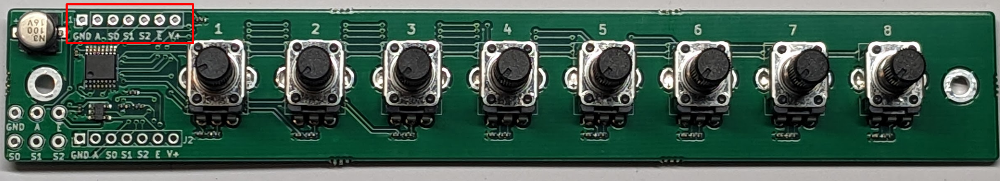

# 8-knobs-san kit

[Document in Japanese](README_ja.md)
## PCB board with 8 Potentiometers

8-knobs-san is a handy PCB with 8 potentiometers and analog multiplexer.
You can connect another 8-knobs-san PCB with same GPIOs, by switching /Enable pin with builtin inverter.

## Kit contents

- Pre-assembled circuit board
- 1x7 pin socket

## How to assemble

Solder the included 1x7 pin socket into the following place below:

## Sample program

Please refer to the software/exapmle <https://github.com/kinoshita-lab/8-knobs-san/tree/main/software/example>
